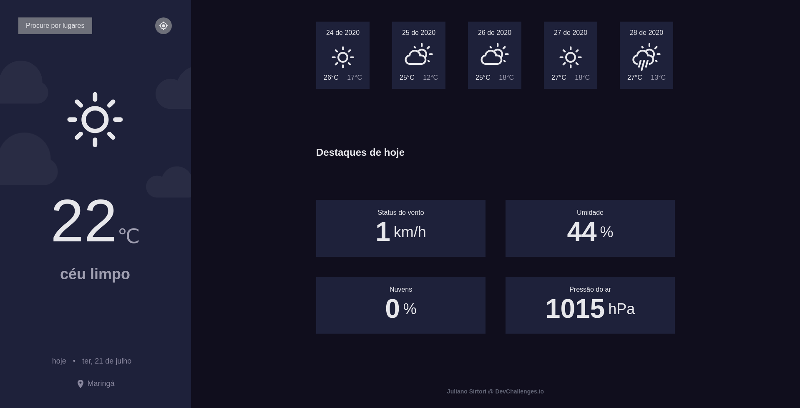

<h1 align="center"> Weather App </h1>

  
  

## Features

- ⚛ **React**
- ♻ **Context API**
- 💅 **CSS** — styled-components
- 💖 **Eslint**
- 💖 **Openweathermap**

## Getting started

1. Clone this repo using `https://git@github.com:julianosirtori/Weather-App.git`
2. Move to the appropriate directory: `cd Weather-App`. 
3. Run `yarn` to install dependencies. 
4. Copy and rename file .env.example `cp .env.example .env` 
4. Generate your key api in <a href="https://openweathermap.org/api">openweathermap</a> and paste in REACT_APP_API_KEY  
4. Run `yarn start` to see the example app at `http://localhost:3000`.
